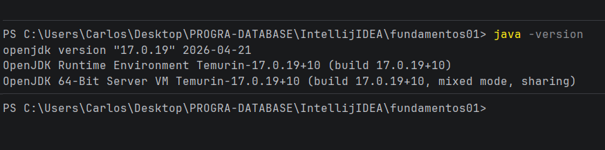
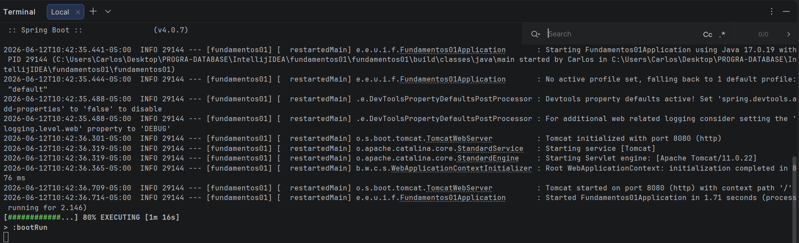
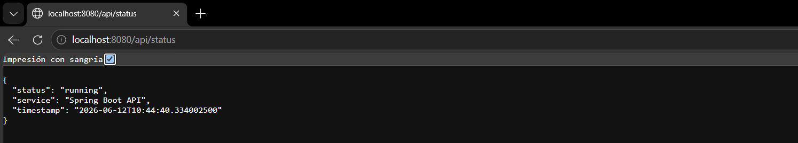
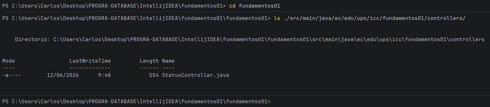
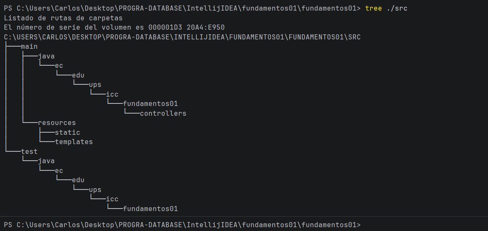

# Programación y Plataformas Web

# Frameworks Backend: Spring Boot – Instalación y Configuración

  

## Práctica 1 (Spring Boot): Instalación, Configuración Inicial y Primer Endpoint

## Autores

**Carlos Antonio Gordillo Tenemaza**
* 📧 Correo: [antoniogordillo.1808@gmail.com](mailto:antoniogordillo.1808@gmail.com)
* 💻 GitHub: [antonikr8s](https://github.com/antonikr8s)
* 💼 LinkedIn: [Carlos Gordillo](https://linkedin.com/in/carlos-antonio-gordillo-tenemaza-828540281/)  

---

## Capturas de Pantalla

### 1. Captura de verificación de Java
**Descripción:** EValidación de que el entorno está configurado con Java 17 (Temurin).

### 2. Captura del servidor Spring Boot ejecutándose
**Descripción:** Ejecución exitosa del servidor embebido de Spring Boot.

### 3. Captura del endpoint /api/status funcionando en el navegador o Postman o Bruno
**Descripción:** Respuesta del endpoint REST verificado en el navegador.

### 4. Captura del siguiente comando en terminal
**Descripción:** Estructura de paquetes y archivos implementada según la práctica.

---

## Explicación breve escrita por el estudiante

### 1. ¿Cómo funciona el endpoint creado?

El endpoint /api/status actúa como un punto de acceso entre el usuario y la aplicación. Cuando se realiza una solicitud a esa dirección, Spring Boot recibe la petición, ejecuta el método correspondiente y devuelve una respuesta con información del sistema, como el nombre del servicio y la hora actual. Estos datos se envían en formato JSON, lo que facilita su lectura e intercambio entre aplicaciones.

### 2. ¿Cuál es la función general de Spring Boot en la creación del servidor?

Spring Boot simplifica el desarrollo de aplicaciones web al proporcionar una estructura y configuración ya preparadas. Gracias a esto, no es necesario configurar manualmente cada componente del servidor, ya que el framework incorpora las herramientas necesarias para ejecutar la aplicación. Esto permite desarrollar y poner en marcha un servidor de forma más rápida, reduciendo la complejidad y facilitando el mantenimiento del proyecto.

