# Programación y Plataformas Web

# Frameworks Backend: Spring Boot – Control Global de Errores y Excepciones

  
  

# Práctica 10 (Spring Boot): Paginación de Productos con Page, Slice y Pageable

## Autores

**Carlos Antonio Gordillo Tenemaza**
* 📧 Correo: [antoniogordillo.1808@gmail.com](mailto:antoniogordillo.1808@gmail.com)
* 💻 GitHub: [antonikr8s](https://github.com/antonikr8s)
* 💼 LinkedIn: [Carlos Gordillo](https://linkedin.com/in/carlos-antonio-gordillo-tenemaza-828540281/)  

---

## Capturas de Pantalla

### 1. Captura del metodo POST para ingresar cinco productos
**Descripción:** Evidencia de la ejecución exitosa de peticiones HTTP con el método `POST` hacia el endpoint `/api/products` utilizando Postman. Se observa el envío de la estructura en formato JSON (`CreateProductDto`) y la respuesta correcta del servidor con un estado `200 OK` / `201 Created`, retornando el producto persistido con su identificador único (`id`) asignado dinámicamente
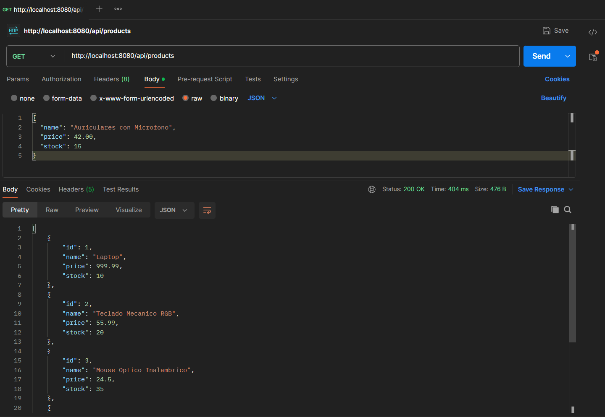

### 2. Captura del DBeaver
**Descripción:** Verificación de la persistencia real en el entorno de base de datos a través de DBeaver. Mediante la ejecución de la consulta sugerida *SELECT * FROM products;*, se comprueba que las cinco entidades fueron almacenadas correctamente en la tabla de PostgreSQL (`devdb`) gestionada dentro del contenedor Docker. Se evidencia la asignación secuencial de las claves primarias y el funcionamiento de los campos de auditoría heredados de `BaseEntity`.
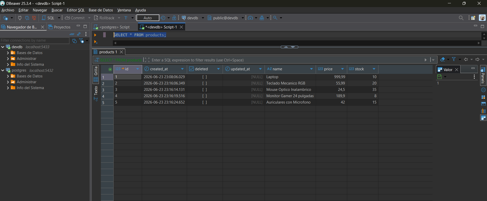

### 3. Validación de Auditoría y Eliminación Lógica en PostgreSQL
**Descripción:** Evidencia del estado final de la base de datos `devdb` en DBeaver tras la ejecución del escenario de pruebas solicitado en clase. Se verifica el correcto funcionamiento del ciclo de vida de los datos gestionados por JPA e Hibernate a través de las siguientes observaciones:
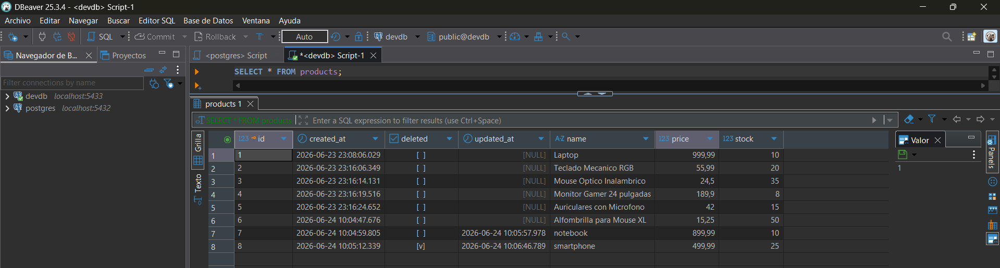

## Práctica 6 (Spring Boot): Validación de DTOs y Control de Datos de Entrada

### Prueba 1: Validar formato erróneo
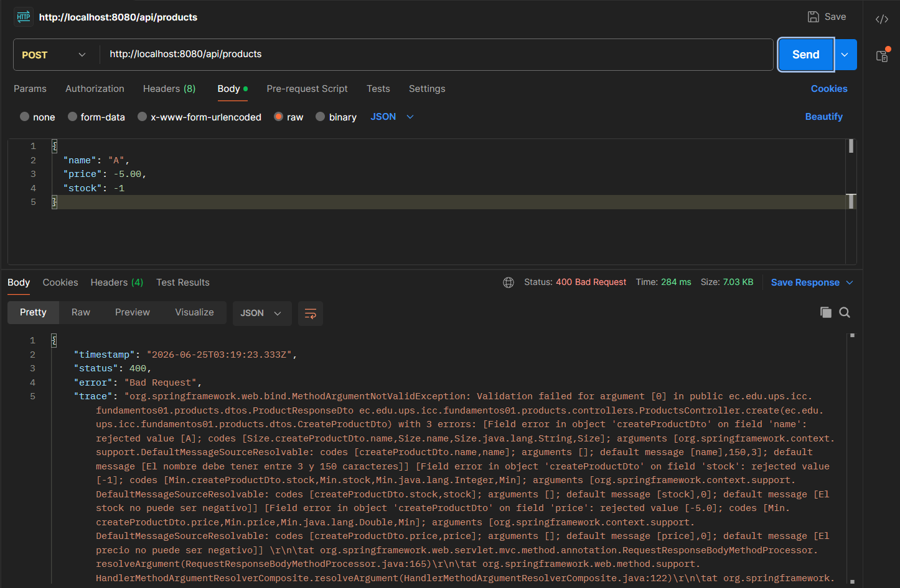

### Prueba 2: Crear un producto válido
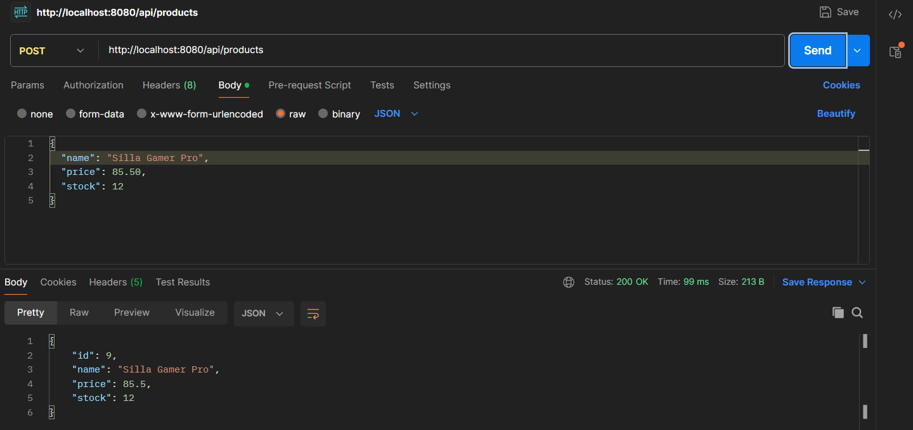

### Prueba 3: Validar regla de negocio - Eliminar el producto
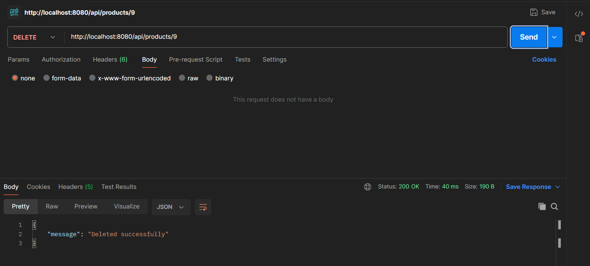

### Prueba 4: Validar regla de negocio - Intentar actualizar un producto eliminado
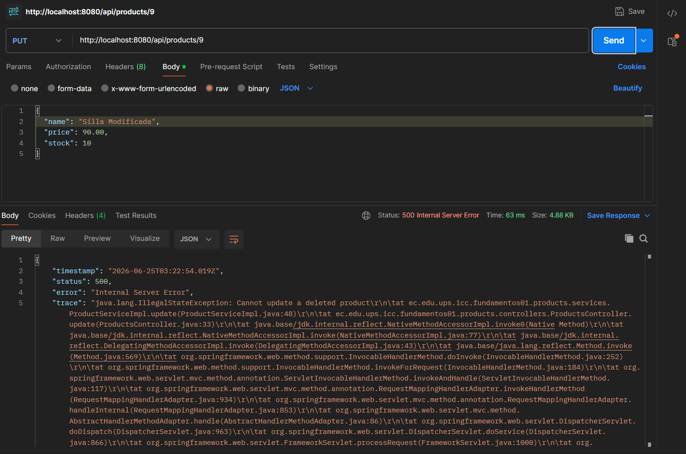

### Prueba 5: Validar regla de negocio - `findAll`
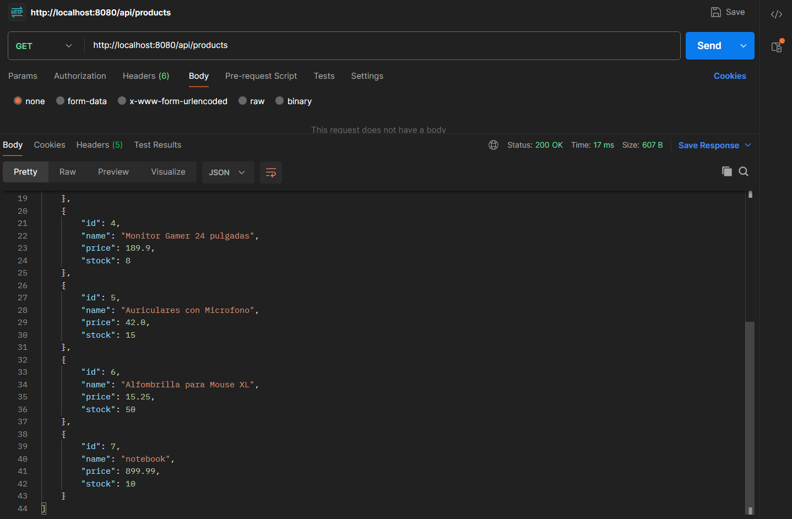

### Verificar en DBeaver
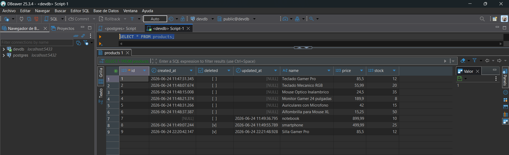

## Práctica 7 (Spring Boot): Manejo Global de Errores y Excepciones

### Prueba 1: Buscar producto inexistente
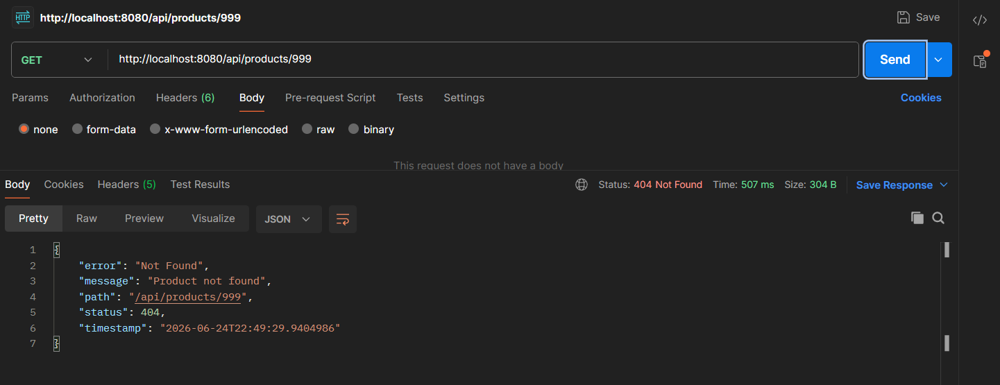

### Prueba 2: Nombre de producto duplicado
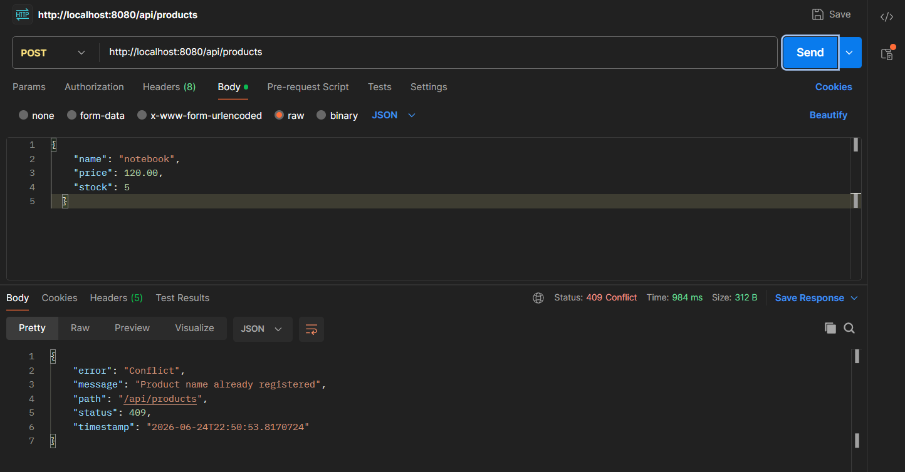

### Prueba 3: Validación estructurada de DTO
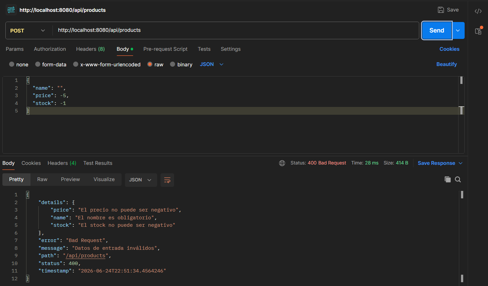

### Prueba 4: Flujo de Eliminado Lógico a Inexistente
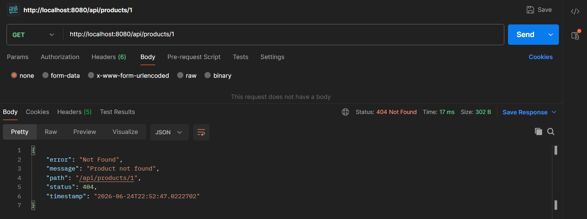

### Actualización en DBeaver
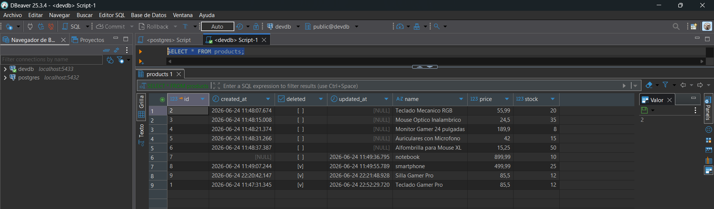

## Práctica 10 (Spring Boot): Paginación de Productos con Page, Slice y Pageable

### Ejecutar `seed_data.sql` (cargar los datos)
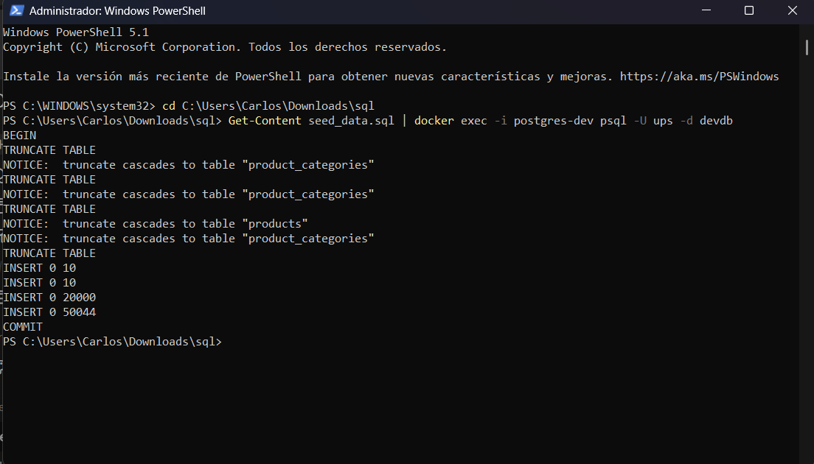

### Captura de respuesta con Page
**Descripción:** `GET` /api/products/page?page=0&size=5
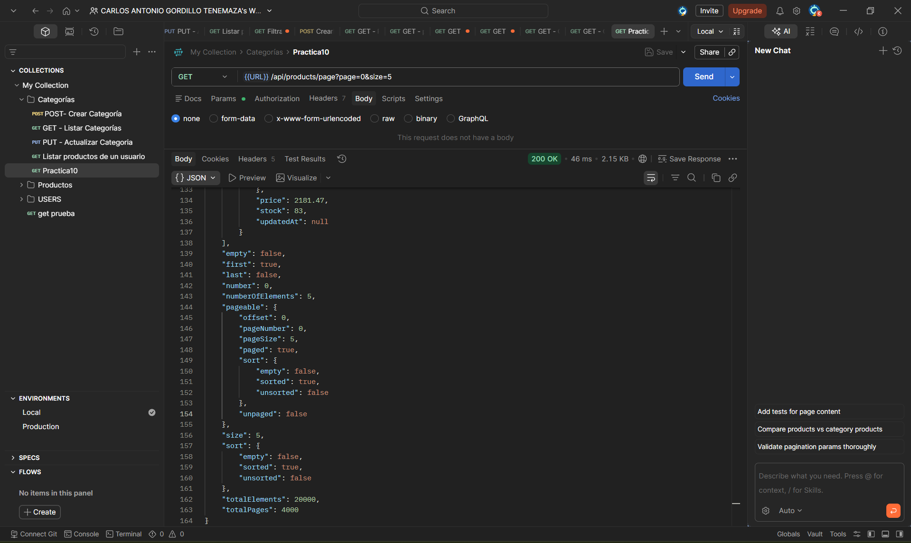

### Captura de respuesta con Slice
**Descripción:** `GET` /api/products/slice?page=0&size=5

### Captura de error por paginación inválida
**Descripción:** `GET` /api/products/page?page=-1&size=0
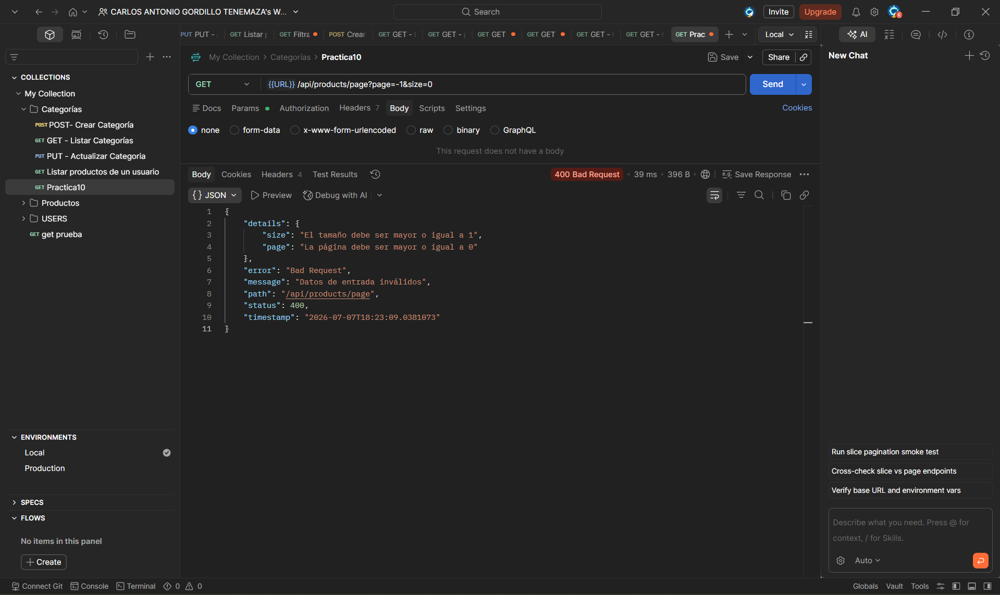

### Captura de endpoint de categoría paginado
**Descripción:** `GET` /api/categories/2/products/page?page=110&size=5
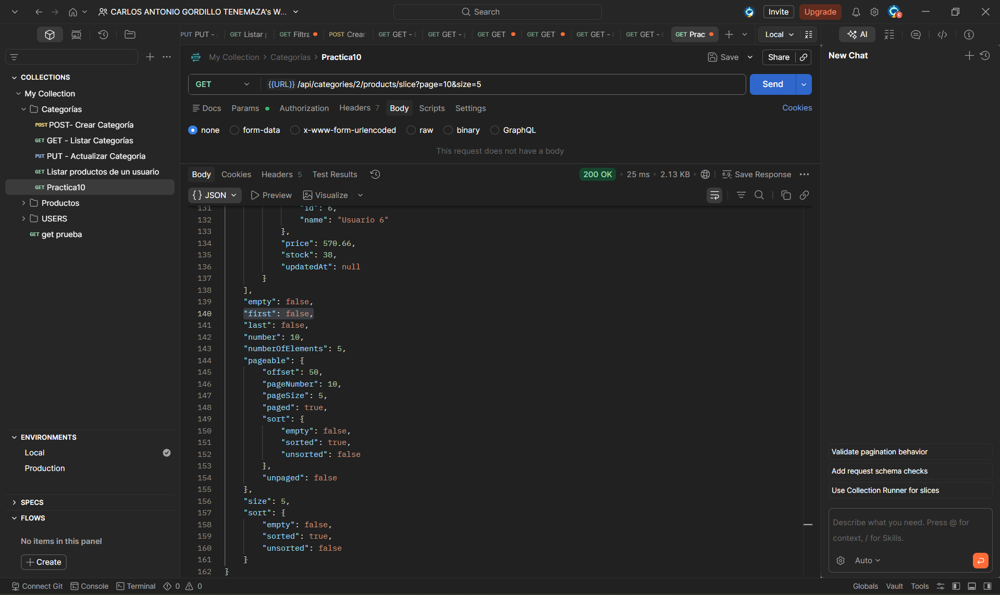

### Captura de endpoint de categoría paginado
**Descripción:** `GET` /api/categories/2/products/slice?page=10&size=5

---

## Explicación del Flujo de Datos Completo (API REST ↔ PostgreSQL)

### 1. Petición (Ida)

El cliente, por ejemplo Postman, envía una solicitud HTTP con los datos en formato JSON. El controlador recibe la petición y la envía al servicio, donde se ejecuta la lógica de negocio correspondiente.

### 2. Transformación y Persistencia

En la capa de servicio, los datos recibidos se transforman de un DTO a un modelo interno y luego a una entidad. Después, el repositorio utiliza Hibernate para guardar la información en la base de datos PostgreSQL mediante una operación de inserción.

### 3. Rol de BaseEntity

La entidad hereda de la clase BaseEntity, que proporciona automáticamente campos comunes como el identificador, las fechas de creación y actualización, y el estado lógico del registro. Además, estos valores se gestionan de forma automática mediante anotaciones de persistencia, evitando código repetitivo.

### 4. Respuesta (Vuelta)

Una vez almacenados los datos, PostgreSQL genera el identificador del registro y devuelve la información guardada. Posteriormente, la entidad se transforma en un DTO de respuesta y se envía al cliente con un estado HTTP exitoso.

### 5. ¿Cuál es la diferencia entre Page y Slice?

`Page` devuelve una respuesta paginada completa, incluyendo los datos, el número total de registros y el total de páginas disponibles. Para obtener esta información, Spring Data JPA realiza una consulta para recuperar los datos y otra para contar el número total de registros.

Por otro lado, `Slice` solo indica si existe una página siguiente o anterior, sin calcular el total de registros. Esto lo hace más eficiente cuando únicamente se necesita navegar entre páginas.

En general, Page es recomendable cuando se requiere mostrar el número total de resultados o páginas, mientras que Slice es una mejor opción para funciones como el desplazamiento infinito (infinite scroll), donde la prioridad es el rendimiento.

### 6. ¿Por qué la paginación debe aplicarse en el repositorio y no después de traer todos los datos en memoria?

La paginación debe realizarse en el repositorio para que la base de datos devuelva únicamente los registros solicitados. Si primero se cargan todos los datos en memoria y luego se paginan, el sistema consume más memoria, utiliza más ancho de banda y aumenta el tiempo de respuesta, especialmente cuando existen miles de registros.

Al utilizar Pageable, Spring Data JPA traduce la solicitud a instrucciones SQL como LIMIT y OFFSET, permitiendo que la base de datos envíe solo los datos necesarios. Esto mejora el rendimiento y hace que la aplicación sea más eficiente y escalable.