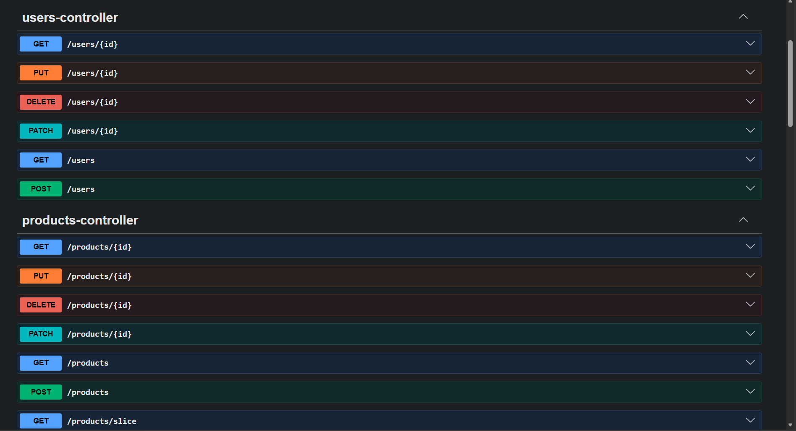

# Programación y Plataformas Web

# Spring Boot – Autenticación y Autorización con JWT: Seguridad y Control de Acceso

  
  
  

## Práctica 16: Despliegue portable de Spring Boot con Docker y Nginx en Ubuntu Server

## Autores

**Carlos Antonio Gordillo Tenemaza**
* 📧 Correo: [antoniogordillo.1808@gmail.com](mailto:antoniogordillo.1808@gmail.com)
* 💻 GitHub: [antonikr8s](https://github.com/antonikr8s)
* 💼 LinkedIn: [Carlos Gordillo](https://linkedin.com/in/carlos-antonio-gordillo-tenemaza-828540281/)  

---

## Capturas de Pantalla

### 1. Captura del metodo POST para ingresar cinco productos
**Descripción:** Evidencia de la ejecución exitosa de peticiones HTTP con el método `POST` hacia el endpoint `/api/products` utilizando Postman. Se observa el envío de la estructura en formato JSON (`CreateProductDto`) y la respuesta correcta del servidor con un estado `200 OK` / `201 Created`, retornando el producto persistido con su identificador único (`id`) asignado dinámicamente

### 2. Captura del DBeaver
**Descripción:** Verificación de la persistencia real en el entorno de base de datos a través de DBeaver. Mediante la ejecución de la consulta sugerida *SELECT * FROM products;*, se comprueba que las cinco entidades fueron almacenadas correctamente en la tabla de PostgreSQL (`devdb`) gestionada dentro del contenedor Docker. Se evidencia la asignación secuencial de las claves primarias y el funcionamiento de los campos de auditoría heredados de `BaseEntity`.

### 3. Validación de Auditoría y Eliminación Lógica en PostgreSQL
**Descripción:** Evidencia del estado final de la base de datos `devdb` en DBeaver tras la ejecución del escenario de pruebas solicitado en clase. Se verifica el correcto funcionamiento del ciclo de vida de los datos gestionados por JPA e Hibernate a través de las siguientes observaciones:

## Práctica 6 (Spring Boot): Validación de DTOs y Control de Datos de Entrada

### Prueba 1: Validar formato erróneo

### Prueba 2: Crear un producto válido

### Prueba 3: Validar regla de negocio - Eliminar el producto

### Prueba 4: Validar regla de negocio - Intentar actualizar un producto eliminado

### Prueba 5: Validar regla de negocio - `findAll`

### Verificar en DBeaver

## Práctica 7 (Spring Boot): Manejo Global de Errores y Excepciones

### Prueba 1: Buscar producto inexistente

### Prueba 2: Nombre de producto duplicado

### Prueba 3: Validación estructurada de DTO

### Prueba 4: Flujo de Eliminado Lógico a Inexistente

### Actualización en DBeaver

## Práctica 8 (Spring Boot): Relaciones ManyToOne, Foreign Keys y Consultas Relacionales

### 1. Creacion  de una categoria

### 2. Creación de un producto con sus relaciones

### 3. Descripción de la tabla products en PostgreSQL
**Descripción:** Para ver el producto creado

**Descripción:** Para ver la relación

### Explicación 1: Funcionamiento de las relaciones `@ManyToOne` y `@OneToMany` en JPA

En Spring Data JPA, las relaciones entre las tablas de la base de datos se representan en las clases del programa usando anotaciones. En este caso, se relacionan las entidades **Producto** y **Categoría**.

- **`@ManyToOne` en Producto:** Indica que **muchos productos pueden pertenecer a una sola categoría**. Por ejemplo, varios productos pueden pertenecer a la categoría "Tecnología". `@JoinColumn(name = "category_id")` indica la columna que se utiliza para relacionar el producto con su categoría.

- **`@OneToMany` en Categoría:** Indica que **una categoría puede tener muchos productos**. Por ejemplo, una categoría puede contener varios productos. `mappedBy = "category"` indica que la relación ya está controlada desde la entidad `Producto`.

- **`FetchType.LAZY`:** Indica que los datos relacionados se cargan **solo cuando son necesarios**. Por ejemplo, los productos de una categoría se consultan únicamente cuando el programa necesita acceder a ellos. Esto ayuda a mejorar el rendimiento.

## Práctica 9 (Spring Boot): Request Parameters, Consultas Relacionadas y Filtrado con JPA

### 1: Producto con varias categorías
**Descripción:** Vamos a crear un producto complejo que encaje en varias de las categorías

### 2. Consulta con filtros por usuario
**Descripción:** Se muestra los productos que creó un usuario específico.

### 3. Consulta con filtros por nombres
**Descripción:** Se muestra los productos por el nombre 'Sensores'.

### 4. Consulta con filtros por categoría

### Explicación 1: Relación `@ManyToMany` y `@JoinTable`

La relación `@ManyToMany` se utiliza cuando **un producto puede tener varias categorías y una categoría puede pertenecer a varios productos**.

Como esta relación conecta muchas categorías con muchos productos, se necesita una **tabla intermedia** en la base de datos para relacionar ambas entidades.

En Spring Boot, esto se configura en la entidad `Product` mediante la anotación `@JoinTable`. En ella se indica el nombre de la tabla intermedia, por ejemplo, `product_categories`, y las columnas que relacionan los productos y las categorías.

- **`joinColumns`:** Indica la columna que contiene el ID del producto.
- **`inverseJoinColumns`:** Indica la columna que contiene el ID de la categoría.

De esta manera, la tabla intermedia permite relacionar fácilmente los productos con sus diferentes categorías.

---

### Explicación 2: Filtrado dinámico y Repositorios

El filtrado de productos por usuario y categoría se realiza mediante **Spring Data JPA**.

Para buscar los productos de un usuario específico, se pueden crear métodos en el repositorio, como `findByUserId(Long id)`. A partir del nombre del método, Spring Data JPA genera automáticamente la consulta necesaria para buscar los productos que pertenecen a ese usuario.

Estos métodos se utilizan desde la capa de servicio, mientras que el controlador recibe los datos necesarios para realizar el filtro mediante parámetros de consulta (`@RequestParam`) o variables de la URL (`@PathVariable`).

De esta forma, cada capa cumple una función específica y el filtrado se realiza directamente en la base de datos, evitando cargar datos innecesarios.

## Práctica 10 (Spring Boot): Paginación de Productos con Page, Slice y Pageable

### Ejecutar `seed_data.sql` (cargar los datos)

### Captura de respuesta con Page
**Descripción:** `GET` /api/products/page?page=0&size=5

### Captura de respuesta con Slice
**Descripción:** `GET` /api/products/slice?page=0&size=5

### Captura de error por paginación inválida
**Descripción:** `GET` /api/products/page?page=-1&size=0

### Captura de endpoint de categoría paginado
**Descripción:** `GET` /api/categories/2/products/page?page=110&size=5

### Captura de endpoint de categoría paginado
**Descripción:** `GET` /api/categories/2/products/slice?page=10&size=5

## Práctica 10 (Spring Boot): Paginación de Productos con Page, Slice y Pageable

### 1. Paginación General con `Page<T>` (`GET /api/products/page`)
**Descripción:** Respuesta esperada: Un objeto JSON que incluye la lista content junto con la estructura de metadatos completa (totalElements, totalPages, number, size).

### 2: Paginación General con `Slice<T>` (`GET /api/products/slice`)
**Descripción:** Respuesta esperada: Un objeto JSON con el listado content y banderas booleanas simplificadas (first, last, hasNext, hasPrevious, numberOfElements), sin incluir totalElements ni totalPages.

### 1. Explicación Técnica: Diferencia entre `Page<T>` y `Slice<T>`

En Spring Data JPA, `Page<T>` y `Slice<T>` permiten dividir grandes cantidades de datos en páginas más pequeñas. La principal diferencia está en la información que devuelven y en la forma en que realizan las consultas a la base de datos.

| Característica | `Page<T>` | `Slice<T>` |
|---|---|---|
| **Consulta `COUNT`** | Realiza una consulta adicional para conocer el total de registros. | No realiza una consulta `COUNT`. Solo consulta los datos necesarios. |
| **Información devuelta** | Proporciona el total de páginas y el total de elementos. | Indica si existe una página siguiente o anterior. |
| **Rendimiento** | Puede tener un mayor costo debido a la consulta adicional de conteo. | Tiene un mejor rendimiento porque evita la consulta de conteo. |
| **Uso ideal** | Cuando se necesita mostrar el total de páginas y registros. | Cuando solo se necesita avanzar o retroceder entre páginas, como en un scroll infinito. |

---

### Explicación 1: ¿Por qué `Slice<T>` realiza la consulta usando `size + 1`?

`Slice<T>` necesita saber si existe una página siguiente, pero sin realizar una consulta `COUNT`.

Para lograrlo, Spring Data JPA solicita **un registro adicional** a la cantidad de elementos que debe mostrar.

Por ejemplo, si la página debe mostrar **10 productos**, se solicitan **11 productos**:

- Si se encuentran **11 productos**, significa que existe una página siguiente. El producto adicional se elimina y `hasNext()` devuelve `true`.
- Si se encuentran **10 productos o menos**, significa que no hay más datos y `hasNext()` devuelve `false`.

De esta manera, `Slice<T>` puede saber si existe una página siguiente sin realizar una consulta adicional para contar todos los registros.

---

## Explicación 2: Impacto en el Rendimiento y Optimización de Consultas

Cuando la base de datos contiene una gran cantidad de registros, realizar una consulta `COUNT(*)` en cada petición puede aumentar el tiempo de respuesta y consumir más recursos.

`Slice<T>` evita esta consulta adicional, ya que solo busca los datos necesarios y un registro extra para comprobar si existe una página siguiente.

Por esta razón, `Slice<T>` puede ofrecer un **mejor rendimiento** cuando no es necesario conocer el número total de páginas o registros.

## Práctica 11 (Spring Boot): Autenticación JWT, Autorización por Roles y Protección de Endpoints

### 1. Registro de usuario nuevo
**Descripción:** Debe responder `201 Created` con un `token`, el `userId`, `name`, `email` y `roles`: `["ROLE_USER"]`.

### 2. Verifica en DBeaver que se guardó bien
**Descripción:** Debe mostrar el usuario con rol `ROLE_USER`.

### 3. Login con ese usuario
**Descripción:** Debe responder `200 OK` con un nuevo token.

### 4. Login con contraseña incorrecta (caso de error)
**Descripción:** Mismo endpoint, pero con `"password": "incorrecta"`. Debe responder `401` (no `500`).

### 5. Registro con email duplicado (caso de error)
**Descripción:** Debe responder `409 Conflict` ("El email ya está registrado").

### 6. Endpoint protegido SIN token
**Descripción:** Sin ningún header `Authorization`. Debe responder `401 Unauthorized` con el JSON de `ErrorResponse` que armamos en el `JwtAuthenticationEntryPoint` (con `timestamp`, `status`, `error`, `message`, `path`).

### 7. Endpoint protegido CON token
**Descripción:** Ahora debe responder `200 OK` con la lista normal de productos.

## Práctica 12 (Spring Boot): Autenticación JWT, Autorización por Roles y Protección de Endpoints

### 1. Creacion de con usuario normal

### 2. Login con usuario normal
**Descripción:** Debe dar 403 Forbidden con mensaje "No tienes permisos para acceder a este recurso"

### 3. Asignar ROLE_ADMIN a un usuario (DBeaver)
**Descripción:** Ajusta el `user_id` al del usuario que quieres volver admin — verifica el id real en la tabla users

### 4. Login con usuario ADMIN

### 5. Petición Exitosa usando un usuario con rol `ROLE_ADMIN`

### 6. Usuario con rol `ROLE_USER` intenta eliminar un registro
**Descripción:** El usuario 11 está intentando borrar el producto del usuario 1,

## Práctica 13 (Spring Boot): Validación de Propiedad de Recursos

### 1. Captura de creación de producto con usuario autenticado
**Descripción:** Crear producto con el `TOKEN` del Usuario X.

### 2. Captura de bloqueo por producto ajeno
**Descripción:** Usuario Z intenta actualizar el producto de Usuario X. Resultado esperado `403 Forbidden`

### 3. Captura de eliminación de producto ajeno bloqueada
**Descripción:** Usuario Z intenta eliminar el producto de Usuario X. `403 Forbidden`

### 4. Captura de ADMIN modificando producto ajeno
**Descripción:** En `DBEAVER` se otorga permisos al usuario para tener el `ROLE_ADMIN`.

Despues de otorgar permisos de `ROLE_ADMIN`, se vuelve a ejecutar el `DELETE`. Resultado esperado `200 OK`.

### 1. Bloqueo a usuarios estándar (`403 Forbidden`)

Se comprobó que un usuario no puede modificar o eliminar un producto que pertenece a otro usuario.

Cuando el usuario intenta realizar una petición `PUT` o `DELETE` sobre un producto que no le pertenece, el sistema bloquea la operación y devuelve un error `403 Forbidden`.

Esto evita que un usuario pueda modificar o eliminar información de otros usuarios.

### 2. Acceso especial para Administradores

Los usuarios con el rol `ROLE_ADMIN` tienen permisos especiales y pueden ignorar la restricción de propiedad.

Esto permite que un administrador pueda modificar o eliminar cualquier producto del sistema cuando sea necesario, por ejemplo, para realizar tareas de mantenimiento o administración.

## Práctica 14 (Spring Boot): Renovación de Access Token con Refresh Token

### 1. Captura de refresh exitoso

## Práctica 15 (Spring Boot): Documentación de Endpoints con Swagger, OpenAPI y Seguridad JWT

### 1. Levantamiento del servicio

## Práctica 16: Despliegue portable de Spring Boot con Docker y Nginx en Ubuntu Server

### 1. Instalacion de Docker en Ubuntu
**Descripción:** Crear la red y el Postgres, dentro de la VM (por `SSH`)

### 2. Clonar el repositorio dentro de la VM
**Descripción:** Postgres-dev está corriendo correctamente en el puerto 5433, dentro de app-network

### 3. Crear el archivo `.env.ubuntu`
**Descripción:** Protege el archivo: `chmod 600 .env.ubuntu` y se confirma con `cat .env.ubuntu`

### 3. Crear el archivo `.env.ubuntu`
**Descripción:** Protege el archivo: `chmod 600 .env.ubuntu` y se confirma con `cat .env.ubuntu`

---

## Explicación del Flujo de Datos Completo (API REST ↔ PostgreSQL)

### 1. Petición (Ida)

El cliente, por ejemplo Postman, envía una solicitud HTTP con los datos en formato JSON. El controlador recibe la petición y la envía al servicio, donde se ejecuta la lógica de negocio correspondiente.

### 2. Transformación y Persistencia

En la capa de servicio, los datos recibidos se transforman de un DTO a un modelo interno y luego a una entidad. Después, el repositorio utiliza Hibernate para guardar la información en la base de datos PostgreSQL mediante una operación de inserción.

### 3. Rol de BaseEntity

La entidad hereda de la clase BaseEntity, que proporciona automáticamente campos comunes como el identificador, las fechas de creación y actualización, y el estado lógico del registro. Además, estos valores se gestionan de forma automática mediante anotaciones de persistencia, evitando código repetitivo.

### 4. Respuesta (Vuelta)

Una vez almacenados los datos, PostgreSQL genera el identificador del registro y devuelve la información guardada. Posteriormente, la entidad se transforma en un DTO de respuesta y se envía al cliente con un estado HTTP exitoso.

### 5. ¿Cuál es la diferencia entre Page y Slice?

`Page` devuelve una respuesta paginada completa, incluyendo los datos, el número total de registros y el total de páginas disponibles. Para obtener esta información, Spring Data JPA realiza una consulta para recuperar los datos y otra para contar el número total de registros.

Por otro lado, `Slice` solo indica si existe una página siguiente o anterior, sin calcular el total de registros. Esto lo hace más eficiente cuando únicamente se necesita navegar entre páginas.

En general, Page es recomendable cuando se requiere mostrar el número total de resultados o páginas, mientras que Slice es una mejor opción para funciones como el desplazamiento infinito (infinite scroll), donde la prioridad es el rendimiento.

### 6. ¿Por qué la paginación debe aplicarse en el repositorio y no después de traer todos los datos en memoria?

La paginación debe realizarse en el repositorio para que la base de datos devuelva únicamente los registros solicitados. Si primero se cargan todos los datos en memoria y luego se paginan, el sistema consume más memoria, utiliza más ancho de banda y aumenta el tiempo de respuesta, especialmente cuando existen miles de registros.

Al utilizar Pageable, Spring Data JPA traduce la solicitud a instrucciones SQL como LIMIT y OFFSET, permitiendo que la base de datos envíe solo los datos necesarios. Esto mejora el rendimiento y hace que la aplicación sea más eficiente y escalable.